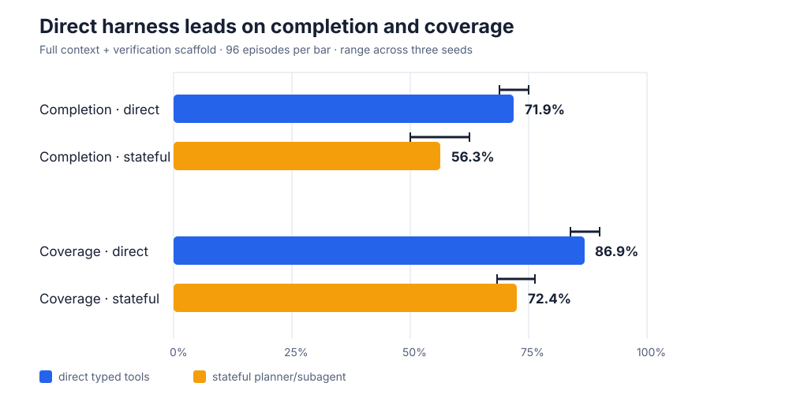
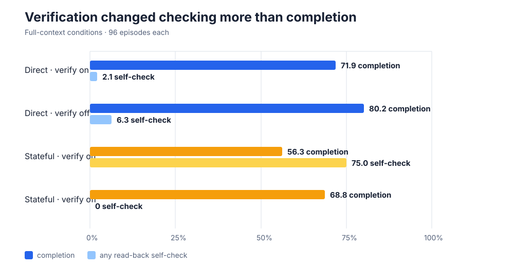
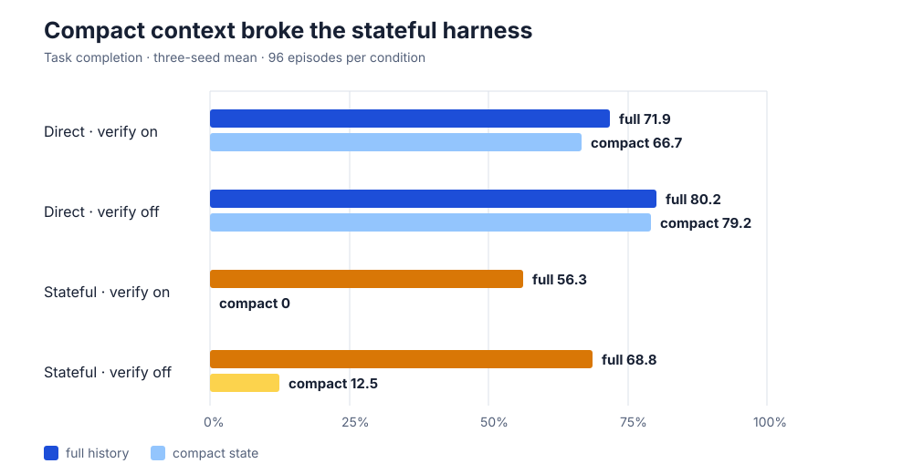
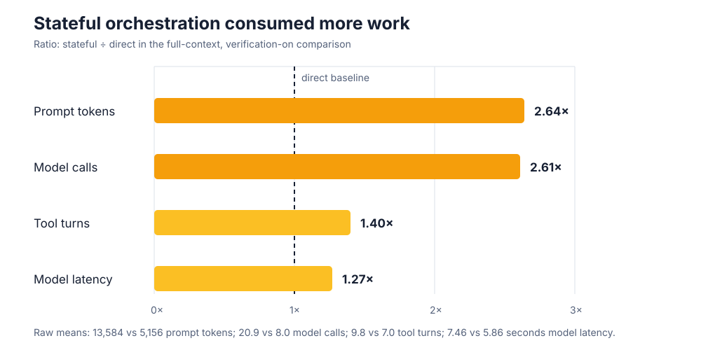

# Does the agent harness change what a fixed model can do?

Tool-using language models do not act alone: a surrounding “harness” decides how they see history, call tools, and split work into roles. OpenForgeRL argues that this surrounding machinery changes what agents can learn and how reliably they behave. We tested that mechanism with one public model and a small executable task suite, changing only the harness scaffolding.

## Verdict

**Partially reproduced.** In the matched headline setting, the simple direct typed-tool harness completed **71.9%** of tasks, versus **56.3%** for a stateful planner/subagent harness—a **15.6 percentage-point** advantage. Required-service coverage was **86.9% versus 72.4%**. The direction held in all three seeds, but this is a downscaled mechanism test: it uses Qwen2.5-7B-Instruct, reconstructed harnesses, and 32 new tasks rather than the authors’ Qwen3 model, checkpoints, ClawEval environments, or SFT/GRPO training.

Exact Molab URL: https://molab.marimo.io/github/alphaXiv/openforgerl-train-harness-native-agents-in-any-e/blob/main/notebooks/openforgerl_harness_reproduction.py

**How to read this:** each bar aggregates 96 episodes—32 tasks × three seeds—with full history and the same verification reminder. Thin ranges show the seed minima and maxima. “Coverage” is the fraction of required services invoked; the stricter all-services-called rate was tied at 46.9%.

## What the paper reports

OpenForgeRL’s Table 4 compares the same trained model across four real harnesses. The simpler direct-tool ZeroClaw reaches **48.5% pass@1**, versus **20.9%** for OpenClaw and **32.5%** for Codex; the authors argue that direct custom-tool integration is easier to learn. Their Figure 5 separately shows RL changing behavior inside Codex: self-verification rises from **50% to 79%**, tool coverage from **79% to 86%**, and error recovery from **17% to 26%**, still the weakest capability.

We did not have the unreleased tasks, OpenForge checkpoints, or synthesized environments. Accordingly, we tested the narrower causal mechanism: can scaffolding alone change completion, coverage, verification, and recovery with weights and external task information fixed?

## Executable setup

The suite contains 32 deterministic operations tasks. Each spans three to five mock services—directory, inventory, calendar, helpdesk, messaging, billing, and documents—and every task injects one first-attempt `TRANSIENT_UNAVAILABLE` failure. Success is verified from environment state, not model prose.

The direct harness gives one model process typed tools and its interaction history. The stateful harness uses the same model twice per cycle: a planner delegates the next operation, then an executor subagent chooses the typed call from a separate context. Both receive the same base policy prompt, task, tools, temperature, top-p, 12 tool turns, and 3,072 generated-token budget. We crossed harness with full/compact context, verification on/off, and three seeds: **24 successful Kubernetes runs, 768 episodes**.

## Scaffolding changed behavior, not just scores

With full history, the stateful verification scaffold produced read-backs on **75.0%** of tasks, versus **2.1%** for the direct harness, yet completed fewer tasks. Removing that reminder reduced stateful self-checking to zero while increasing completion from **56.3% to 68.8%**. The scaffold therefore changed policy behavior substantially, but “more verification” was not automatically “more reliable” under a fixed turn budget.

After a failed command, the direct verified harness retried the failed operation in **96.9%** of episodes and ultimately recovered in **74.2%** of episodes that encountered the injected failure. The stateful counterpart retried in **86.5%** and recovered in **56.3%**. This aligns with the paper’s warning that recovery is fragile, although our explicit retry hint makes the absolute rates incomparable to its 17–26%.

## Context management was the sharpest stress test

Keeping only four recent events had a modest effect on direct completion. The stateful planner/executor flow, however, fell from **56.3% to 0%** with verification and from **68.8% to 12.5%** without it. Its compact-state agents exhausted all 12 turns while repeatedly losing plan state; mean service coverage fell to 37.5–49.2%. This is strong evidence for the second target claim: context scaffolding changes multi-step planning and recovery even without changing model weights or external tools.

## Reliability came with overhead

In the headline comparison, the stateful harness used **2.64×** as many prompt tokens and **2.61×** as many model calls per task. It also used 1.40× as many tool turns and incurred 1.27× model latency. Generated tokens stayed within the identical episode budget (456 versus 312 on average), so the gap is not explained by giving the direct harness more generation allowance.

## Claim-by-claim assessment

| Target claim | Paper evidence | Observed evidence | Assessment |
|---|---|---|---|
| Simpler direct-tool harness improves completion and coverage | ZeroClaw 48.5 pass@1; OpenClaw 20.9; Codex 32.5 | Direct 71.9% completion / 86.9% coverage; stateful 56.3% / 72.4% | **Aligned in this reconstruction** |
| Scaffolding changes verification and error recovery | RL shifts self-check 50→79 and recovery 17→26 inside Codex | Stateful vs direct self-check 75.0% vs 2.1%; conditional recovery 56.3% vs 74.2%; compact state causes 0–12.5% completion | **Aligned behaviorally; absolute values incomparable** |
| SFT/GRPO improves trained OpenForge agents | Multiple benchmark gains in the paper | No training attempted | **Not attempted** |

Kubernetes supplied all evidence on **NVIDIA RTX PRO 6000 Blackwell** GPUs, peaking at **16 concurrent GPUs**. The successful evidence window was **15m15s (0.2542 wall hours)**, from 07:29:12Z to 07:44:27Z on 2026-07-28. Formal branches include [direct/full/verified](https://github.com/alphaXiv/openforgerl-train-harness-native-agents-in-any-e/tree/orx/direct-full-verified-seed-0-manifest-fix), [stateful/full/verified](https://github.com/alphaXiv/openforgerl-train-harness-native-agents-in-any-e/tree/orx/stateful-full-verify-true-seed-0), [direct/compact](https://github.com/alphaXiv/openforgerl-train-harness-native-agents-in-any-e/tree/orx/direct-compact-verify-true-seed-0), and [stateful/compact](https://github.com/alphaXiv/openforgerl-train-harness-native-agents-in-any-e/tree/orx/stateful-compact-verify-true-seed-0). Per-run values and all ablations are embedded in the [notebook](../../notebooks/openforgerl_harness_reproduction.py) and CSV files.
